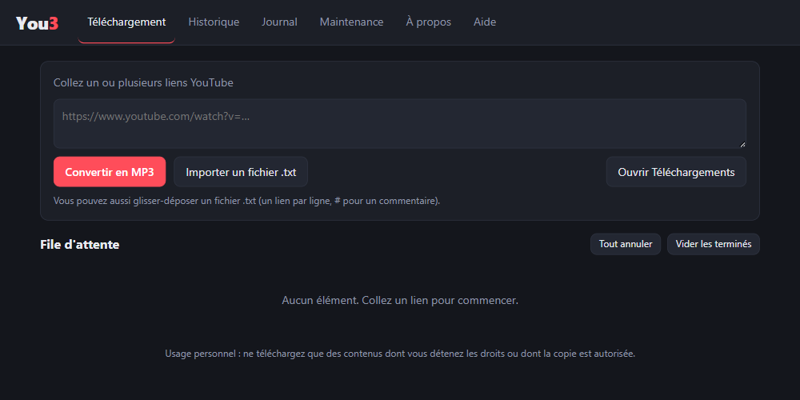
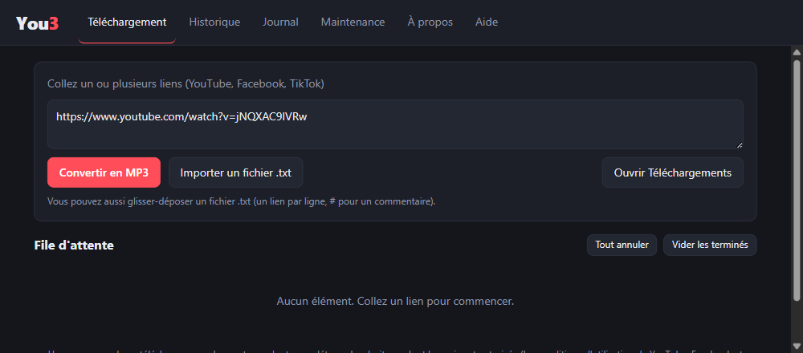
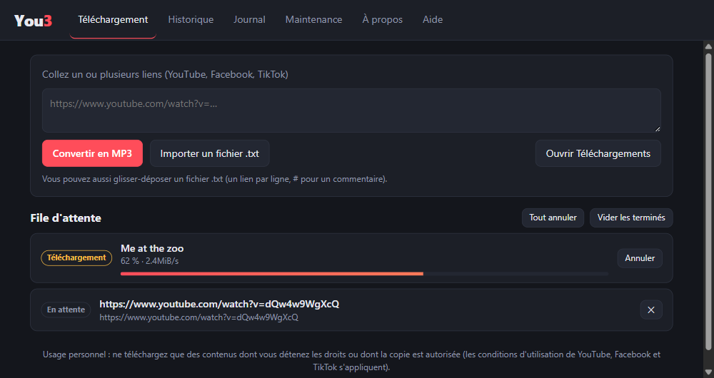
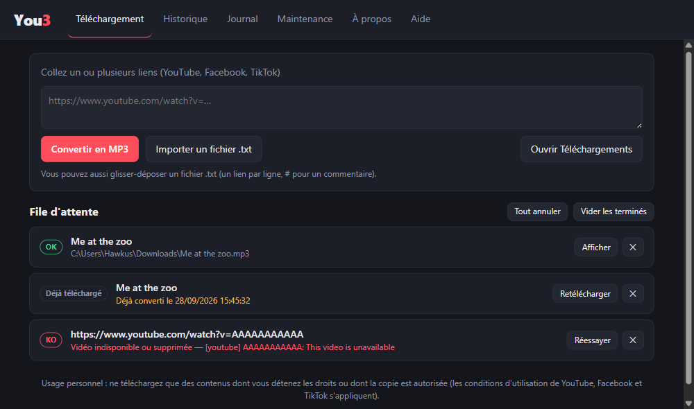
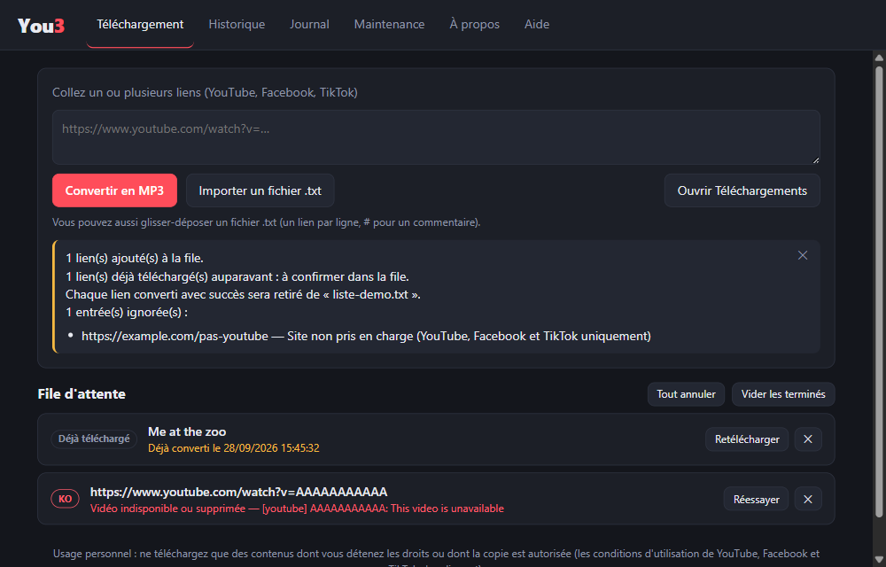
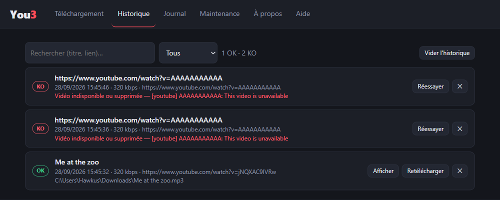
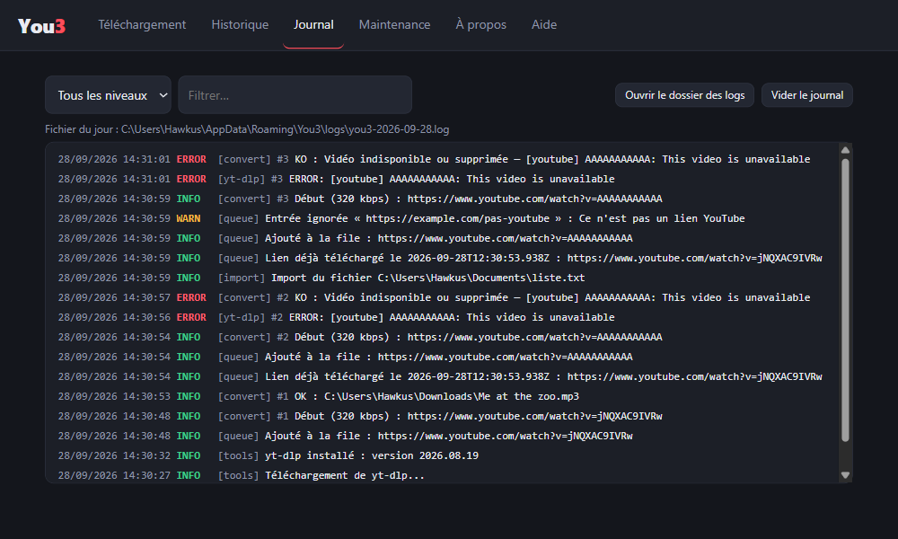
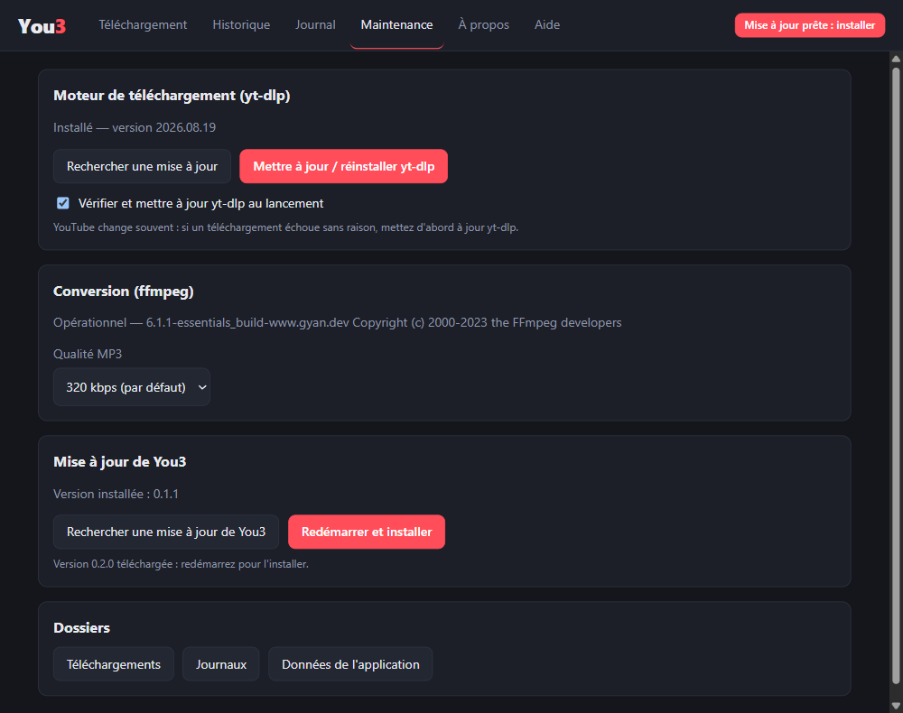
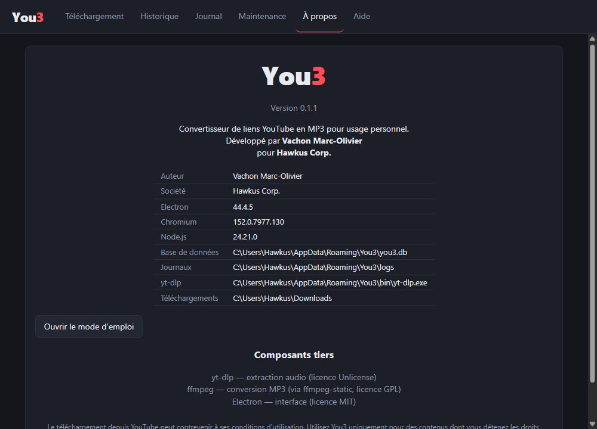

# You3 : mode d'emploi

**You3** convertit des vidéos YouTube en fichiers **MP3**. Vous collez un lien (ou vous chargez une liste de liens dans un fichier `.txt`), et l'application enregistre le MP3 dans votre dossier **Téléchargements**.

Application développée par **Vachon Marc-Olivier** pour **Hawkus Corp.**, pour un usage personnel.

> Ce mode d'emploi correspond à You3 0.1.x pour Windows. Il est aussi disponible dans l'application : menu **Aide → Mode d'emploi** (touche **F1**).

## Sommaire

- [1. Installer You3](#1-installer-you3)
- [2. Prise en main en 3 étapes](#2-prise-en-main-en-3-étapes)
- [3. Convertir un lien](#3-convertir-un-lien)
- [4. Convertir plusieurs liens avec un fichier .txt](#4-convertir-plusieurs-liens-avec-un-fichier-txt)
- [5. La file d'attente](#5-la-file-dattente)
- [6. Où sont mes MP3 ?](#6-où-sont-mes-mp3-)
- [7. Les doublons](#7-les-doublons)
- [8. L'historique](#8-lhistorique)
- [9. Le journal](#9-le-journal)
- [10. La maintenance et les mises à jour](#10-la-maintenance-et-les-mises-à-jour)
- [11. Le menu et les raccourcis](#11-le-menu-et-les-raccourcis)
- [12. Vos données, désinstallation](#12-vos-données-désinstallation)
- [13. Dépannage](#13-dépannage)
- [14. Limites de la version actuelle](#14-limites-de-la-version-actuelle)
- [15. Confidentialité et usage légal](#15-confidentialité-et-usage-légal)

---

## 1. Installer You3

**Configuration nécessaire** : Windows 10 ou 11 en 64 bits, et une connexion internet (pour télécharger les vidéos et pour les mises à jour).

### Télécharger l'installeur

1. Ouvrez la page : <https://github.com/Hawkus22/You3/releases/latest>
2. Dans la section **Assets**, cliquez sur **You3-Setup-x.y.z.exe** (x.y.z est le numéro de version). Le fichier pèse environ 130 Mo.
3. Attendez la fin du téléchargement, puis ouvrez le fichier depuis votre dossier Téléchargements.

### Lancer l'installation

L'installeur n'est pas « signé » (la signature numérique est payante). Windows affiche donc un avertissement la première fois :

1. Si la fenêtre **« Windows a protégé votre ordinateur »** apparaît, cliquez sur **Informations complémentaires**.
2. Cliquez ensuite sur **Exécuter quand même**.
3. Suivez l'assistant d'installation (en français) : choisissez le dossier d'installation si vous voulez le changer, puis cliquez sur **Installer**.
4. À la fin, laissez la case « Exécuter You3 » cochée et cliquez sur **Terminer**.

L'installation se fait pour votre compte Windows : aucun droit administrateur n'est demandé. Un raccourci est créé sur le bureau et dans le menu Démarrer.

> Selon l'antivirus, le fichier peut être analysé plus longtemps que d'habitude au premier lancement : c'est normal pour un programme non signé.

### Premier lancement

Au tout premier démarrage, You3 télécharge son moteur de téléchargement, **yt-dlp** (environ 20 Mo). Un message « Préparation de yt-dlp… » s'affiche en haut à droite pendant quelques secondes. **Attendez qu'il disparaisse** avant de lancer votre première conversion. Cette étape n'a lieu qu'une seule fois.

### Installer sur un autre ordinateur

Recommencez les étapes ci-dessus sur l'autre PC. Chaque PC a sa propre installation, avec son historique et ses journaux : rien n'est synchronisé entre vos machines.

---

## 2. Prise en main en 3 étapes


*L'écran d'accueil : un champ pour les liens et la file d'attente en dessous.*

1. **Copiez** l'adresse d'une vidéo YouTube (barre d'adresse du navigateur, ou bouton « Partager » de YouTube).
2. **Collez-la** dans le champ de You3 (`Ctrl+V`). La conversion démarre toute seule.
3. **Récupérez** votre MP3 dans le dossier **Téléchargements** (bouton « Ouvrir Téléchargements », ou bouton « Afficher » sur la ligne terminée).

C'est tout. Le reste de ce document détaille chaque fonction.

---

## 3. Convertir un lien

### Coller un lien

Cliquez dans le champ « Collez un ou plusieurs liens YouTube » et collez l'adresse.


*Le lien est collé dans le champ.*

- **Le collage lance la conversion automatiquement.** Vous n'avez rien d'autre à faire.
- Si vous préférez taper ou modifier le lien à la main, validez avec la touche **Entrée** ou le bouton **Convertir en MP3**. Pour aller à la ligne dans le champ sans valider, utilisez **Maj+Entrée**.
- Vous pouvez coller **plusieurs liens à la fois** (un par ligne, ou séparés par des espaces, virgules ou points-virgules).

### Les liens acceptés

| Type de lien | Exemple | Accepté |
|---|---|---|
| Lien classique | `https://www.youtube.com/watch?v=jNQXAC9IVRw` | Oui |
| Lien court | `https://youtu.be/jNQXAC9IVRw` | Oui |
| YouTube Shorts | `https://www.youtube.com/shorts/…` | Oui |
| YouTube Music, version mobile | `music.youtube.com`, `m.youtube.com` | Oui |
| Lien sans `https://` | `youtube.com/watch?v=jNQXAC9IVRw` | Oui |
| Playlist entière | `https://www.youtube.com/playlist?list=…` | **Non** (refusé avec un message) |
| Site autre que YouTube | `https://exemple.com/…` | **Non** (refusé avec un message) |

### Liens avec `list=` ou `radio=` (Mix et playlists)

Certains liens contiennent, après l'identifiant de la vidéo, des morceaux comme `&list=RD…&start_radio=1`. Ils viennent du bouton « Mix » de YouTube (une playlist « radio » générée automatiquement).

**You3 ne télécharge que la vidéo indiquée par `v=`**, jamais la playlist ou le Mix. Vous obtenez donc un seul MP3, celui du morceau en cours.

### Suivre la progression


*Un téléchargement en cours (barre de progression, vitesse) et un lien en attente.*

Chaque lien devient une ligne dans la **file d'attente**. La conversion se déroule en plusieurs phases :

1. **Analyse du lien** : You3 interroge YouTube.
2. **Téléchargement** : le pourcentage et la vitesse s'affichent.
3. **Conversion en MP3** : quand le téléchargement atteint 100 %, l'audio est converti.
4. **Terminé** (étiquette verte **OK**) ou **Échec** (étiquette rouge **KO**).

Quand toute la file est terminée, Windows affiche une **notification** (« 3 MP3 enregistré(s) dans Téléchargements ») et l'icône de You3 clignote dans la barre des tâches si la fenêtre n'est pas au premier plan.

### Résultat


*Trois cas possibles : un succès (OK), un lien déjà converti auparavant, et un échec (KO) avec son explication.*

---

## 4. Convertir plusieurs liens avec un fichier .txt

Pour une longue liste, préparez un fichier texte avec **un lien par ligne**.

### Format du fichier

Créez un fichier `.txt` avec le Bloc-notes :

```
# Ma liste de morceaux
https://www.youtube.com/watch?v=jNQXAC9IVRw

# Les lignes qui commencent par # sont des commentaires
https://youtu.be/dQw4w9WgXcQ
```

- **Un lien par ligne** (les espaces, virgules et points-virgules fonctionnent aussi comme séparateurs).
- Les **lignes vides** sont ignorées.
- Les lignes qui commencent par **`#`** sont des **commentaires** : ignorées, utiles pour vous organiser.
- Un lien présent deux fois n'est traité qu'une fois.
- Fichier `.txt` uniquement, 5 Mo maximum.
- Un fichier enregistré en UTF-8 (avec ou sans BOM), avec des fins de ligne Windows ou Unix, est accepté.

### Charger le fichier

Deux méthodes :

- Cliquez sur **Importer un fichier .txt** (ou `Ctrl+O`) et choisissez le fichier. La fenêtre de sélection s'ouvre par défaut sur votre **Bureau**, avec le nom **`Playlist1.txt`** déjà proposé : si votre liste s'appelle ainsi et se trouve sur le Bureau, il suffit de valider.
- Ou **glissez-déposez** le fichier n'importe où dans la fenêtre de You3 : un cadre pointillé rouge apparaît autour de la zone de saisie.

### Effacer les liens du fichier après conversion

Dans les deux cas, une fenêtre vous demande : **« Voulez-vous effacer les entrées du .txt après conversion ? »**, avec deux boutons, **Oui** et **Non** (fermer la fenêtre revient à répondre Non).

- **Non** : le fichier n'est jamais modifié.
- **Oui** : dès qu'un lien est **converti avec succès**, sa ligne est retirée du fichier `.txt`. Vous suivez ainsi ce qu'il reste à faire.
  - Les liens **en échec** (KO) **restent** dans le fichier, pour pouvoir les réessayer.
  - Les liens **« Déjà téléchargé »** restent aussi tant que vous n'avez pas cliqué sur **Retélécharger** et que la conversion n'a pas réussi.
  - Si une ligne contient plusieurs liens, seul le lien converti est retiré.
  - Les commentaires (`#`) et les lignes vides ne sont pas modifiés.
  - Si le fichier est en lecture seule, You3 vous prévient : les liens sont convertis, mais rien n'est effacé.

> Le fichier est modifié au fur et à mesure des conversions. Évitez de le modifier vous-même pendant qu'elles sont en cours, ou enregistrez-le avant de le rouvrir.

### Le compte rendu


*Après l'import, un encadré résume ce qui a été ajouté, ce qui était déjà téléchargé et ce qui a été ignoré.*

L'encadré jaune indique :
- combien de liens ont été **ajoutés** à la file ;
- combien étaient **déjà téléchargés** auparavant (voir [Les doublons](#7-les-doublons)) ;
- combien de **doublons** ont été ignorés dans la liste ;
- si vous avez répondu Oui, le rappel que chaque lien converti sera retiré du fichier ;
- la **liste des entrées ignorées**, avec la raison (lien non YouTube, playlist, identifiant introuvable). Les huit premières s'affichent.

Cet encadré disparaît quand vous cliquez sur sa croix **✕**, sur **Vider les terminés** ou sur **Tout annuler**. Il n'est jamais conservé d'une ouverture de l'application à l'autre.

Les conversions démarrent automatiquement, **une à la fois**, dans l'ordre de la liste.

---

## 5. La file d'attente

La file d'attente est la liste située sous le champ de saisie. Elle montre tous les liens de la session en cours.

### Les étiquettes

| Étiquette | Signification |
|---|---|
| **En attente** (gris) | Le lien attend son tour. |
| **Téléchargement** / **Conversion en MP3** (orange) | Le lien est en cours de traitement. |
| **OK** (vert) | Le MP3 est enregistré ; le chemin du fichier est affiché. |
| **KO** (rouge) | La conversion a échoué ; la raison est affichée en rouge. |
| **Déjà téléchargé** (gris) | Ce lien a déjà été converti auparavant ; rien n'est fait tant que vous n'avez pas confirmé. |

### Les boutons de chaque ligne

| Bouton | Où | Effet |
|---|---|---|
| **Annuler** | ligne en cours | Arrête la conversion en cours. Elle est notée KO « Annulé par l'utilisateur ». |
| **✕** | ligne en attente, terminée ou en erreur | Retire la ligne de la file (n'efface aucun fichier). |
| **Afficher** | ligne OK | Ouvre l'Explorateur Windows avec le MP3 sélectionné. |
| **Réessayer** | ligne KO | Relance la conversion. |
| **Retélécharger** | ligne « Déjà téléchargé » | Confirme que vous voulez le convertir à nouveau. |

### Les boutons en haut de la liste

- **Tout annuler** : annule la conversion en cours et les liens en attente, et ferme l'encadré de compte rendu.
- **Vider les terminés** : retire de la liste les lignes OK, KO et « Déjà téléchargé », et ferme l'encadré de compte rendu.

> La file d'attente ne garde que la session en cours. Pour retrouver ce qui a été converti avant, utilisez l'[Historique](#8-lhistorique).

Si vous fermez You3 pendant une conversion, elle est interrompue et notée **KO** (« Interrompu ») au démarrage suivant. Relancez-la simplement depuis l'historique.

---

## 6. Où sont mes MP3 ?

Les MP3 sont enregistrés dans le **dossier Téléchargements par défaut de Windows** (généralement `C:\Users\VotreNom\Downloads`). Le bouton **Ouvrir Téléchargements** l'ouvre directement.

- **Nom du fichier** : le titre de la vidéo, par exemple `Me at the zoo.mp3`. Les caractères interdits par Windows (`\ / : * ? " < > |`) sont remplacés, et les titres très longs sont raccourcis.
- **Fichier déjà existant** : You3 n'écrase jamais rien. Si `Titre.mp3` existe, le nouveau fichier s'appelle `Titre (1).mp3`, puis `Titre (2).mp3`, etc.
- **Qualité** : 320 kbps par défaut (modifiable, voir [Maintenance](#10-la-maintenance-et-les-mises-à-jour)).
- **Informations intégrées** : titre, artiste et pochette (la miniature de la vidéo) sont inscrits dans le fichier MP3 quand YouTube les fournit. Votre lecteur de musique les affiche.

---

## 7. Les doublons

You3 se souvient de tout ce qu'il a converti avec succès. Si vous collez un lien **déjà converti**, il ne le retélécharge pas sans votre accord.

La ligne affiche l'étiquette **Déjà téléchargé** et la date de la conversion précédente, par exemple : « Déjà converti le 28/09/2026 14:24:43 ».

- Si le fichier est **toujours présent** sur le disque, vous n'avez rien à faire.
- Si le fichier a été **supprimé ou déplacé**, la mention « (fichier introuvable sur le disque) » s'ajoute : cliquez sur **Retélécharger** pour le récupérer à nouveau.
- Pour forcer une nouvelle conversion, cliquez sur **Retélécharger**. Le nouveau fichier est enregistré avec un `(1)` pour ne pas écraser l'ancien.

La détection s'appuie sur l'historique : si vous **videz l'historique**, You3 oublie ce qu'il a déjà converti.

---

## 8. L'historique

L'onglet **Historique** conserve la trace de toutes les conversions, réussies (**OK**) ou non (**KO**), même après la fermeture de l'application.


*L'historique : date, qualité, lien, chemin du fichier ou raison de l'échec.*

Chaque ligne indique le titre, la date et l'heure, la qualité (kbps), le lien, et soit le chemin du MP3, soit le message d'erreur.

- **Rechercher** : le champ de recherche filtre par titre, lien ou identifiant de vidéo.
- **Filtrer** : la liste déroulante permet d'afficher tout, seulement les réussites (OK) ou seulement les échecs (KO). Les compteurs « 1 OK · 2 KO » se trouvent à droite.
- **Afficher** : ouvre l'Explorateur sur le fichier. Si le fichier a été déplacé ou supprimé, un message vous l'indique.
- **Retélécharger** / **Réessayer** : remet le lien dans la file d'attente et bascule sur l'onglet Téléchargement.
- **✕** : supprime **cette ligne** de l'historique. Le fichier MP3 n'est pas touché.
- **Vider l'historique** : efface toutes les lignes, après confirmation. Les fichiers MP3 restent sur votre disque, mais la détection des doublons repart de zéro.

L'historique affiche les 500 conversions les plus récentes.

---

## 9. Le journal

L'onglet **Journal** est le « carnet de bord » de You3. Il sert surtout à comprendre pourquoi une conversion a échoué.


*Le journal : chaque ligne indique la date, le niveau, la source et le message. Le numéro `#3` relie la ligne à la conversion correspondante.*

### Les niveaux

| Niveau | Couleur | Signification |
|---|---|---|
| **INFO** | vert | Ce qui se passe normalement (ajout d'un lien, début, succès…). |
| **WARN** | orange | Un avertissement : entrée ignorée, vérification impossible… |
| **ERROR** | rouge | Une erreur : conversion échouée, problème de mise à jour… |
| **DEBUG** | gris | Détails techniques du moteur de téléchargement. |

### Utiliser le journal

- Choisissez un **niveau** dans la liste pour ne voir que les erreurs, par exemple.
- Tapez du texte dans **Filtrer…** pour chercher un mot ou un lien.
- Le journal se met à jour **en direct** pendant les conversions.
- Il affiche les 1 000 dernières lignes.

### Les fichiers journaux

Le même journal est aussi écrit dans un **fichier texte par jour** : `you3-AAAA-MM-JJ.log`. Le chemin du fichier du jour est affiché au-dessus de la liste.

- **Ouvrir le dossier des logs** : ouvre le dossier qui contient ces fichiers (`%APPDATA%\You3\logs`).
- **Vider le journal** : efface le journal affiché dans l'application, mais **conserve les fichiers `.log`**.
- Les journaux de plus de **30 jours** sont supprimés automatiquement.

> Si vous demandez de l'aide pour un problème, joignez le fichier `.log` du jour concerné.

---

## 10. La maintenance et les mises à jour

L'onglet **Maintenance** regroupe les réglages et la mise à jour des composants.


*L'onglet Maintenance : moteur yt-dlp, conversion ffmpeg, mise à jour de You3 et accès aux dossiers.*

### Moteur de téléchargement (yt-dlp)

C'est le programme qui récupère l'audio sur YouTube. YouTube change souvent son fonctionnement : **quand une conversion échoue sans raison apparente, mettez d'abord yt-dlp à jour.**

- **Rechercher une mise à jour** : compare votre version avec la dernière version publiée et vous l'indique.
- **Mettre à jour / réinstaller yt-dlp** : télécharge la dernière version. Impossible pendant une conversion : attendez la fin de la file.
- **Vérifier et mettre à jour yt-dlp au lancement** (case cochée par défaut) : You3 le fait automatiquement à chaque démarrage. C'est recommandé.

### Conversion (ffmpeg) et qualité

**ffmpeg** est le convertisseur audio, livré avec You3 (sa version est affichée ; il est mis à jour avec You3).

La liste **Qualité MP3** permet de choisir : **128 kbps** (fichiers plus petits), **192 kbps**, ou **320 kbps** (meilleure qualité, par défaut). Le choix s'applique aux **prochaines** conversions.

### Mise à jour de You3

You3 vérifie **tout seul**, à chaque lancement, s'il existe une nouvelle version :

1. Si oui, elle est téléchargée **en arrière-plan** (vous pouvez continuer à travailler).
2. Un bouton **« Mise à jour prête : installer »** apparaît en haut à droite, ainsi qu'un bouton **« Redémarrer et installer »** dans la carte « Mise à jour de You3 ».
3. Cliquez dessus : You3 redémarre et se retrouve à jour. Si vous préférez ne rien faire, la mise à jour s'installera à la prochaine fermeture de l'application.


*Une mise à jour est prête : le bouton apparaît en haut à droite et dans l'onglet Maintenance.*

Le bouton **Rechercher une mise à jour de You3** lance la vérification à la demande. Vos données (historique, journaux, réglages) sont conservées lors d'une mise à jour.

### Dossiers

Trois raccourcis : **Téléchargements** (vos MP3), **Journaux** (fichiers `.log`) et **Données de l'application** (base de données de You3).

---

## 11. Le menu et les raccourcis

| Menu | Commande | Raccourci |
|---|---|---|
| **Fichier** | Importer un fichier .txt… | `Ctrl+O` |
| | Ouvrir le dossier Téléchargements | |
| | Quitter | |
| **Aide** | Mode d'emploi | `F1` |
| | Mises à jour… (ouvre l'onglet Maintenance) | |
| | Ouvrir le dossier des journaux | |
| | Outils de développement | `F12` |
| | À propos de You3 | |

Dans le champ de saisie : `Ctrl+V` colle (et lance la conversion), `Entrée` valide, `Maj+Entrée` va à la ligne.

### L'onglet « À propos »


*L'onglet À propos : version, auteur, société, versions des composants et emplacement des fichiers.*

Il affiche la version de You3, l'auteur (**Vachon Marc-Olivier**), la société (**Hawkus Corp.**), les composants utilisés et les emplacements de la base de données, des journaux et de yt-dlp.

---

## 12. Vos données, désinstallation

### Où sont stockées les données ?

Dans le dossier `C:\Users\VotreNom\AppData\Roaming\You3` (tapez `%APPDATA%\You3` dans la barre d'adresse de l'Explorateur) :

| Élément | Rôle |
|---|---|
| `you3.db` (et `you3.db-wal`, `you3.db-shm`) | Base de données : historique, journal, réglages. |
| `logs\` | Fichiers journaux quotidiens. |
| `bin\yt-dlp.exe` | Le moteur de téléchargement. |
| `tmp\` | Fichiers temporaires pendant une conversion (nettoyés automatiquement). |

Vos MP3, eux, sont dans le dossier Téléchargements.

### Désinstaller

1. Fermez You3.
2. Ouvrez **Paramètres Windows → Applications → Applications installées**, cherchez **You3** puis **Désinstaller**.
3. La désinstallation **conserve** vos données et vos MP3. Pour tout effacer, supprimez aussi le dossier `%APPDATA%\You3`.

---

## 13. Dépannage

**Où voir la cause d'un échec ?** Sur la ligne KO (en rouge), dans l'onglet **Historique**, ou dans le **Journal** (filtre `ERROR`).

| Message ou problème | Cause probable | Que faire |
|---|---|---|
| **Vidéo privée** | La vidéo n'est visible que par son propriétaire. | Rien à faire : elle n'est pas accessible. |
| **Vidéo indisponible ou supprimée** | La vidéo a été retirée, ou le lien est faux. | Vérifiez le lien dans votre navigateur. |
| **Restriction d'âge (connexion requise)** | YouTube exige d'être connecté. | Non pris en charge par You3. |
| **Vidéo bloquée dans votre pays** | Restriction géographique. | Non pris en charge. |
| **Réservée aux membres de la chaîne** | Contenu payant. | Non pris en charge. |
| **Diffusion en direct ou première pas encore terminée** | Le direct n'est pas fini. | Réessayez quand la vidéo est terminée. |
| **Problème de connexion réseau** | Pas d'internet, ou coupure. | Vérifiez votre connexion puis cliquez sur **Réessayer**. |
| **YouTube demande une vérification anti-robot** | YouTube limite temporairement les accès. | Attendez un moment et réessayez ; mettez yt-dlp à jour. |
| **Extraction impossible : mettez à jour yt-dlp** | YouTube a changé son fonctionnement. | **Maintenance → Mettre à jour yt-dlp**, puis Réessayer. |
| **yt-dlp est absent** | Le moteur n'a pas pu être téléchargé au premier lancement. | **Maintenance → Mettre à jour / réinstaller yt-dlp** (connexion internet nécessaire). |
| **Le lien est refusé** | Ce n'est pas un lien de vidéo YouTube, ou c'est une playlist. | Copiez l'adresse d'une vidéo précise. |
| **Windows bloque l'installeur** | Programme non signé (SmartScreen). | **Informations complémentaires → Exécuter quand même.** |
| **Rien ne se passe au collage** | Le lien n'est pas reconnu. | Regardez l'encadré jaune sous le champ : il donne la raison. |
| **Le MP3 est introuvable** | Fichier déplacé, ou dossier Téléchargements redirigé. | Bouton **Afficher** sur la ligne, ou chemin indiqué dans l'historique. |
| **You3 ne démarre pas** | Une autre fenêtre de You3 est déjà ouverte (une seule instance à la fois). | Cherchez You3 dans la barre des tâches. |

**Si rien ne fonctionne** : mettez à jour yt-dlp, puis You3 (onglet Maintenance), redémarrez l'application, et conservez le fichier `.log` du jour pour analyse.

---

## 14. Limites de la version actuelle

- **Vidéos uniquement, une à la fois** : les playlists ne sont pas prises en charge (le lien d'une vidéo au sein d'une playlist fonctionne, mais seule cette vidéo est convertie).
- **MP3 uniquement** (pas de M4A, WAV, etc.).
- **Windows 64 bits uniquement.**
- **Connexion internet obligatoire.**
- **Français uniquement.**
- Les vidéos privées, réservées aux membres, soumises à une restriction d'âge ou bloquées géographiquement ne peuvent pas être converties.

---

## 15. Confidentialité et usage légal

### Confidentialité

- **Aucun compte, aucune publicité, aucune statistique d'usage** : You3 n'envoie aucune donnée vous concernant à Hawkus Corp.
- Tout ce que vous faites (historique, journaux, réglages) reste **sur votre ordinateur**.
- You3 se connecte uniquement à : **YouTube** (pour récupérer l'audio) et **GitHub** (pour les mises à jour de You3 et de yt-dlp, et certains composants d'extraction).

### Usage légal

Le téléchargement de contenus depuis YouTube peut aller à l'encontre de ses conditions d'utilisation, et la copie d'œuvres protégées peut être illicite selon les pays.

**Utilisez You3 uniquement pour des contenus dont vous détenez les droits ou dont la copie est autorisée** (vos propres vidéos, contenus libres de droits ou sous licence permettant la copie). Vous êtes responsable de l'usage que vous en faites.

### Composants tiers

You3 s'appuie sur **yt-dlp** (licence Unlicense), **ffmpeg** (licence GPL, via ffmpeg-static) et **Electron** (licence MIT).

---

*You3 — © Hawkus Corp. — Vachon Marc-Olivier. Code source : <https://github.com/Hawkus22/You3>*
